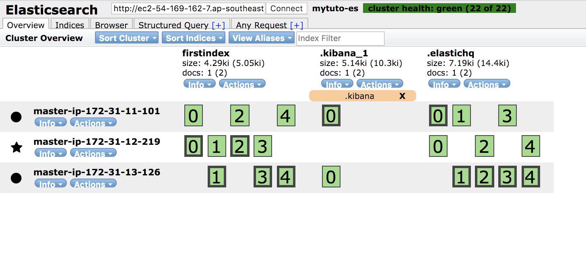

# ES-Tutorial-3

ElasticSearch 세 번째 튜토리얼을 기술합니다.

본 스크립트는 외부 공인망을 기준으로 작성되었습니다.

## Product 별 버전 상세
```
Product Version. 6.6.0(2019/02/07 기준 Latest Ver.)
```
* [Elasticsearch](https://artifacts.elastic.co/downloads/elasticsearch/elasticsearch-6.6.0.rpm)
* [Kibana](https://artifacts.elastic.co/downloads/kibana/kibana-6.6.0-x86_64.rpm)

최신 버전은 [Elasticsearch 공식 홈페이지](https://www.elastic.co/downloads) 에서 다운로드 가능합니다.

## ElasticSearch Product 설치

이 튜토리얼에서는 rpm 파일을 이용하여 실습합니다.

```bash
[ec2-user@ip-xxx-xxx-xxx-xxx ~]$ sudo yum -y install git

[ec2-user@ip-xxx-xxx-xxx-xxx ~]$ git clone https://github.com/benjamin-btn/ES-Tutorial-3.git

[ec2-user@ip-xxx-xxx-xxx-xxx ~]$ cd ES-Tutorial-3

[ec2-user@ip-xxx-xxx-xxx-xxx ES-Tutorial-3]$ ./tuto3
##################### Menu ##############
 $ ./tuto3 [Command]
#####################%%%%%%##############
         1 : install java & elasticsearch packages
         2 : configure elasticsearch.yml & jvm.options
         3 : start elasticsearch process
#########################################


[ec2-user@ip-xxx-xxx-xxx-xxx ES-Tutorial-1]$ ./tuto3 1

```

## ELK Tutorial 3 - Elasticsearch Node 추가

### Elasticsearch
* /etc/elasticsearch/elasticsearch.yml
  1) cluster.name, node.name, http.cors.enabled, http.cors.allow-origin 기존장비와 동일 설정
  2) network.host 를 network.bind_host 와 network.publish_host 로 분리
  3) http.port, transport.tcp.port 추가 설정
  4) node.master, node.data role 추가 설정
  5) discovery.zen.minimum_master_nodes 추가 설정
  6) **discovery.zen.ping.unicast.hosts 는 직접 수정 필요**
  7) 클러스터에 노드 2대가 정상적으로 추가되면 기존 장비의 설정도 동일하게 수정해둡니다.
    - **./tuto3 2 실행 후 discovery.zen.ping.unicast.hosts 에 기존 장비와 추가하는 노드 2대의 ip:9300 설정 필요**


* /etc/elasticsearch/jvm.options
  - Xms1g, Xmx1g 를 물리 메모리의 절반으로 수정

```bash
[ec2-user@ip-xxx-xxx-xxx-xxx ~]$ sudo vi /etc/elasticsearch/elasticsearch.yml
### For ClusterName & Node Name
cluster.name: mytuto-es
node.name: ip-172-31-13-110
### For Response by External Request
network.bind_host: 0.0.0.0
network.publish_host: {IP}

### For Head
http.cors.enabled: true
http.cors.allow-origin: "*"

### ES Node Role Settings
node.master: true
node.data: true

### ES Port Settings
http.port: 9200
transport.tcp.port: 9300

### Discovery Settings
discovery.zen.ping.unicast.hosts: [  "{IP1}:9300",  "{IP2}:9300",  "{IP3}:9300",  ]
discovery.zen.minimum_master_nodes: 2

[ec2-user@ip-xxx-xxx-xxx-xxx ~]$ sudo vi /etc/elasticsearch/jvm.options

- -Xms1g
+ -Xms2g
- -Xmx1g
+ -Xmx2g
```

## Smoke Test

### Elasticsearch

```bash
[ec2-user@ip-xxx-xxx-xxx-xxx ~]$ curl localhost:9200
{
  "name" : "ip-172-31-13-110",
  "cluster_name" : "mytuto-es",
  "cluster_uuid" : "fzHl1JNvRd-3KHlleS1WIw",
  "version" : {
    "number" : "6.6.0",
    "build_flavor" : "default",
    "build_type" : "rpm",
    "build_hash" : "a9861f4",
    "build_date" : "2019-01-24T11:27:09.439740Z",
    "build_snapshot" : false,
    "lucene_version" : "7.6.0",
    "minimum_wire_compatibility_version" : "5.6.0",
    "minimum_index_compatibility_version" : "5.0.0"
  },
  "tagline" : "You Know, for Search"
}

```

* Web Browser 에 [http://ec2-3-0-99-205.ap-southeast-1.compute.amazonaws.com:9100/index.html?base_uri=http://{FQDN}:9200](http://ec2-3-0-99-205.ap-southeast-1.compute.amazonaws.com:9100/index.html?base_uri=http://{FQDN}:9200) 실행



## Trouble Shooting

### Elasticsearch
Smoke Test 가 진행되지 않을 때에는 elasticsearch.yml 파일에 기본으로 설정되어있는 로그 디렉토리의 로그를 살펴봅니다.

path.logs: /var/log/elasticsearch 로 설정되어 cluster.name 이 적용된 파일로 만들어 로깅됩니다.

위의 경우에는 /var/log/elasticsearch/mytuto-es.log 에서 확인할 수 있습니다.

```bash
[ec2-user@ip-xxx-xxx-xxx-xxx ~]$ sudo vi /var/log/elasticsearch/mytuto-es.log
```

